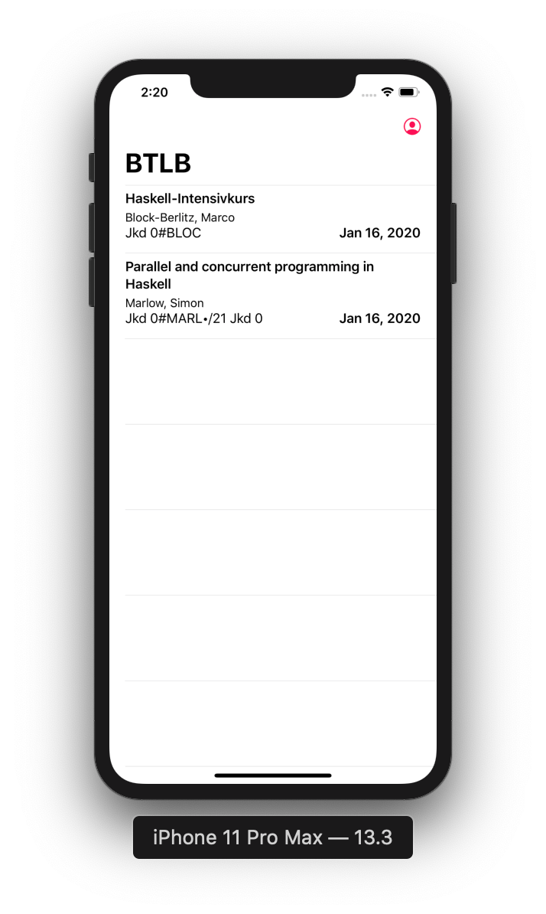

# Books

## Test

`cmd+U` executes all available test suites.

For the Xcode UITests it comes handy to prepare the keyboard in advance so that the monkey can type properly:

`defaults write com.apple.iphonesimulator ConnectHardwareKeyboard -bool false`
